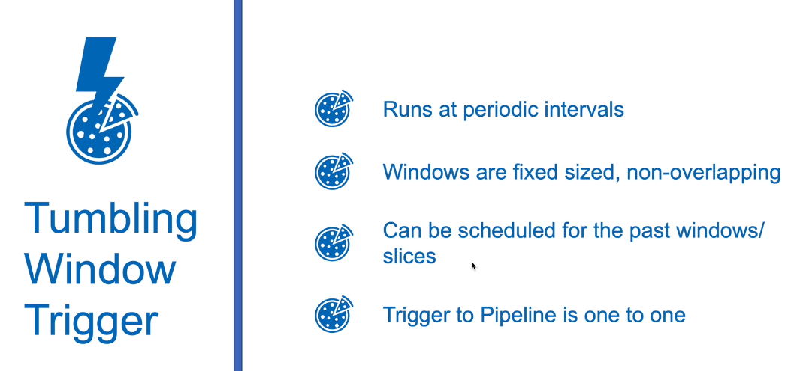

# Section 4: Data Ingestion from Azure Blob

## Copy Activity
### Concept

### My Implementation
#### 1. Linked Service 

#### 2. Datasets

#### 3. Pipelines

##### Handling Real World Scenarios

###### Scenario 1
Source data has been made available by another system within the organization. The data is made available daily and it could become available anytime during the day and we do not know what time it becomes available.
We need to process the data as soon as it become available. There are multiple ways of achieving this, one of them is with using a ***control flow activity*** in data factory. 

###### Scenario 2
IT Systems change and so do the outputs. We want to ensure that the file we have received is as expected before copying the file to the Data Lake. Otherwise. we could inadvertently break in someone else's process.

###### Scenario 3
Let's assume that our requirement, is delete the file from the source location, as soon as the copy has succeeded.

#### 3. Triggers
Data Factory provides the scheduling ability in the form of triggers. You can create triggers and attach them to pipelines so that the pipelines are triggered as specified in the trigger. 

##### Schedule Trigger

Schedule Triggers are essentially designed to operate on a calendar schedule, similar to how you would create meetings in Microsoft Outlook or any other calendar application. This trigger functions in the same manner, supporting both periodic and specific times. The timing does not need to be at regular intervals; for instance, it could be set for 1:00 AM and 10:00 AM every day.

There can be multiple relationships between triggers and pipelines. For example, you could link all your ingestion pipelines to a single trigger, which would then activate all the pipelines simultaneously each day. Conversely, the same pipeline can be invoked from more than one trigger. For instance, you might want to run a database maintenance pipeline during both ingestion and transformation. In this case, you could attach the maintenance pipeline to both the ingestion and transformation triggers.

However, it's important to note that Schedule Triggers can only be scheduled to start in the future. It's not possible, nor does it make sense, to run them for a past day or time.

#### Tumbling Window Trigger

Tumbling Window Triggers are designed to be scheduled for periodic execution from a specified time. They operate within fixed-sized, non-overlapping, and continuous time intervals, proving particularly useful when dealing with data slices. These triggers can be beneficial in scenarios such as ingesting data from a SQL database into a Data Lake at regular intervals.

For instance, imagine a requirement to ingest data every hour and only include data created during that specific hour. By attaching the pipeline to a tumbling window trigger, the pipeline is invoked every hour, passing the window start and end times to the copy activity. The copy activity can then utilize these times to fetch data for that particular time slice.

Notably, Tumbling Window Triggers can be scheduled to run for past dates. This flexibility allows for the ingestion or processing of data from previous slices by simply running that specific slice. For example, fetching data from 9:00 AM to 10:00 AM yesterday can be accomplished by running the corresponding slice.

It's important to acknowledge that Tumbling Window Triggers are tightly coupled with pipelines. This means that each pipeline can have only one trigger, and vice-versa.

While Schedule Triggers might seem to fulfill similar purposes, Tumbling Window Triggers offer significant differences. The intricacies of these differences will be further explored when examining the Tumbling Window Trigger in the context of Data Factory.

#### Storage Events Trigger
They are very simple to explain. They run pipelines in response to an event such as the arrival or a deletion of a file in a Blob storage or a Data Lake storage.

Similar to Scheduled Triggers, you can have many pipelines attached to one trigger and vice versa.

