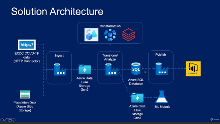

# Azure-Data-Factory-For-Data-Engineers
A dedicated repository where I actively apply and reinforce concepts from the Udemy Azure Data Factory Course through hands-on exercises. 

## Overview
Building a real-world data-pipeline in Azure Data Factory (ADF).

Solution Architecture:

## Section 4: Data Ingestion from Azure Blob
